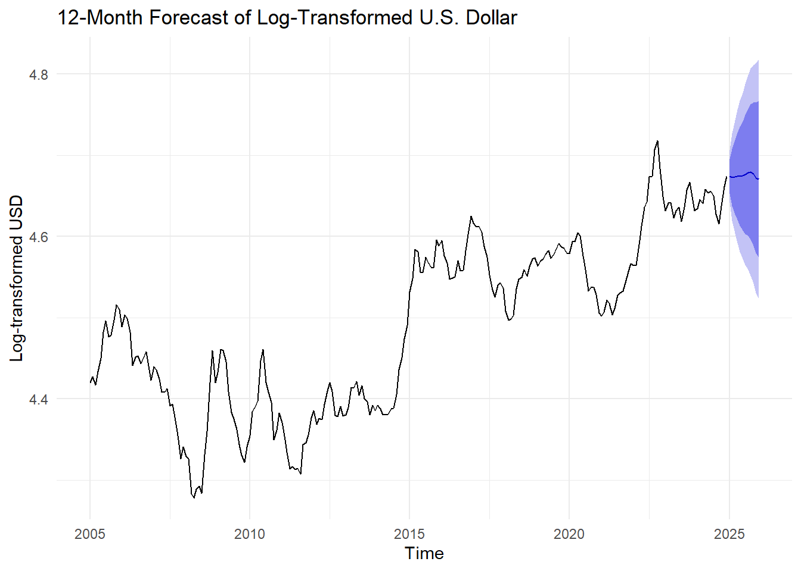
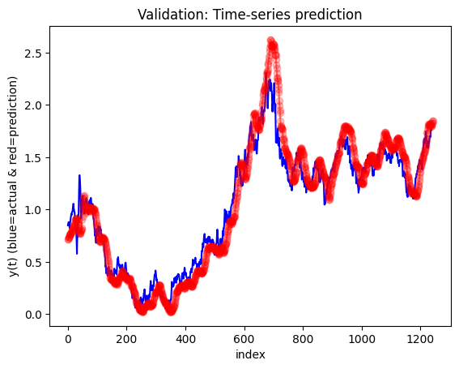

{width="80%"}

This project set out to understand what drives the U.S. Dollar Index and how its value changes over time. By examining the USD from five major perspectives, including trade, macroeconomics, financial markets, commodities, and the real economy, we built a broad foundation for analysis. Our goal was not just to forecast the dollar’s movements, but also to explore the economic forces and real-world events that shape its behavior.

::: {style="text-align: center;"}

```{mermaid}
flowchart LR
    A("U.S. Dollar Index") --> B("International Trade<br>(Imports &amp; Exports)")
    A --> C("Macroeconomic Factors<br>(GDP, Unemployment Rate, CPI, Interest Rate)")
    A --> D("Financial Market<br>(Stock, Bitcoin)")
    A --> E("Global Commodity Market<br>(Gold, Crude Oil)")
    A --> F("Real Economy<br>(Egg Price, Real Estate, Tourism)")
        
    classDef Sky stroke-width:1px, stroke-dasharray:none, stroke:#374D7C, fill:#E2EBFF, color:#374D7C
    A:::Sky
    B:::Sky
    C:::Sky
    D:::Sky
    E:::Sky
    F:::Sky
    
    linkStyle 0 stroke:#BBDEFB,fill:none
    linkStyle 1 stroke:#BBDEFB,fill:none
    linkStyle 2 stroke:#BBDEFB,fill:none
    linkStyle 3 stroke:#BBDEFB,fill:none
    linkStyle 4 stroke:#BBDEFB,fill:none
```

:::

We started by testing whether the USD could be predicted using only its past values. The ARIMA model revealed that the dollar follows a random walk. This means its movement is largely driven by unpredictable shocks rather than stable trends. While the model showed a modest upward trend in its forecast, the results reminded us that no currency moves in isolation. This led us to explore a wide range of influencing factors.

```{r}
library(tidyverse)
library(ggplot2)
library(forecast)
library(astsa) 
library(xts)
library(tseries)
library(fpp2)
library(fma)
library(lubridate)
library(tidyverse)
library(TSstudio)
library(quantmod)
library(tidyquant)
library(plotly)
library(ggplot2)
library(knitr)
library(kableExtra)
library(fGarch)

# Load data
invisible(getSymbols("DX-Y.NYB", src = "yahoo", from = "2005-01-01", to = "2024-12-31"))
dxy <- data.frame(Date = index(`DX-Y.NYB`),
                       Open = `DX-Y.NYB`[, "DX-Y.NYB.Open"], 
                       High = `DX-Y.NYB`[, "DX-Y.NYB.High"], 
                       Low = `DX-Y.NYB`[, "DX-Y.NYB.Low"], 
                       Close = `DX-Y.NYB`[, "DX-Y.NYB.Close"],
                       Adjusted = `DX-Y.NYB`[,"DX-Y.NYB.Adjusted"])
colnames(dxy) <- c("Date", "Open", "High", "Low", "Close", "Adjusted")
dxy <- na.omit(dxy)
dxy$Date <- as.Date(dxy$Date, format = "%m/%d/%Y")

gg <- ggplot(data = dxy, aes(x = Date, y = Close)) +   
  geom_line(color='purple') +  
  labs(x = "Year", title = "Trend of U.S. Dollar Index") +
  theme_minimal()

plotly_gg <- ggplotly(gg)
plotly_gg
```

Through multivariate time series models, we examined how different economic and market forces affect the dollar. Trade deficits, commodity prices, and inflation had clear impacts. Higher inflation and stronger GDP tended to support a stronger dollar, while unemployment and rising commodity prices often weakened it. In financial markets, the USD showed opposite patterns with stock prices and Bitcoin, reflecting different investor behaviors. We also included less conventional variables like egg prices and tourism data to capture signals from the real economy. Together, these models painted a picture of a currency that reacts to a diverse mix of global and domestic conditions.

{width="100%" height="80%"}

Beyond relationships between variables, we also looked at how volatility in the USD has changed over time. Using a GARCH model, we identified periods of financial stress, including the 2008 crisis, the 2011 debt ceiling crisis and the COVID-19 outbreak, as moments when dollar volatility spiked. This highlights the dollar’s role as both a financial barometer and a potential safe haven in uncertain times.

```{r}
library(forecast)

# Fit ARIMA(4,1,2) model to the log-transformed stock prices
arima_412 <- Arima(log(dxy$Adjusted), order = c(4,1,2))

# Get residuals from the fitted ARIMA model
arima.res <- arima_412$residuals

# Fit a GARCH(1,1) model to ARIMA residuals and display summary
garch_model <- garchFit(~ garch(1,1), data = arima.res, trace = FALSE)

# Extract the conditional variances from GARCH
ht <- garch_model@h.t

# Create dataframe and plot
vol_df <- data.frame(Date = dxy$Date, Volatility = ht)

p <- ggplot(vol_df, aes(x = Date, y = Volatility)) +
  geom_line(color = "#ff9933") +
  labs(
    title = "Volatility Plot (Conditional Variance from GARCH Model)",
    x = "Date",
    y = "Conditional Variance"
  ) +
  theme_minimal()

ggplotly(p)
```


To improve forecasting performance, we introduced deep learning models. Among the univariate models, LSTM achieved the best results by capturing long-term dependencies and subtle patterns. GRU models also performed well and were often more stable and efficient. When we used multivariate deep learning, results were more mixed. In some cases, adding external variables such as S&P 500 or Bitcoin prices made forecasts worse instead of better. This taught us an important lesson: more variables do not always lead to better predictions. What matters more is how closely those variables relate to the target and whether they introduce useful signals or just noise.

{width="100%" height="60%"}

We also considered how sudden events can disrupt the dollar’s behavior. The Interrupted Time Series analysis focused on the impact of COVID-19. Although the initial drop in the dollar index around December 2020 was not statistically significant, the long-term trend changed notably. After the intervention, the dollar began to rise faster than before. This suggests that global markets adjusted their expectations in the months following the shock, possibly in response to economic recovery efforts and changing interest rate environments. It also highlights the importance of examining delayed effects rather than focusing only on immediate reactions.

```{r}
dxy_m <- dxy %>%
  mutate(month = floor_date(Date, "month")) %>% 
  group_by(month) %>%
  summarise(Adjusted = mean(Adjusted, na.rm = TRUE))

# Define the intervention date
intervention_date <- as.Date("2020-12-01")

# Created Data Set for the ITS analysis
dataTS <- data.frame(
  Y  = dxy_m$Adjusted,
  Xt = seq_along(dxy_m$Adjusted),
  Zt = ifelse(dxy_m$month < intervention_date, 0, 1),
  Pt = 0
)

# Assign values to Pt only after intervention
dataTS$Pt[dxy_m$month >= intervention_date] <- seq_len(sum(dxy_m$month >= intervention_date))

# Fit the interrupted time series regression model
regTS <- lm(Y ~ Xt + Zt + Pt, data = dataTS)

# Predict from your actual model
pred1 <- predict(regTS, newdata = dataTS)

# Create counterfactual dataset (COVID-19 never happens)
datanew <- data.frame(
  Xt = 1:nrow(dataTS),
  Zt = 0,
  Pt = 0
)
pred2 <- predict(regTS, newdata = datanew)

# Step 3: Add predictions to data
dataTS$Y_hat <- pred1
dataTS$Y_counterfactual <- pred2
dataTS$Xt <- 1:nrow(dataTS)

# Step 4: Create interactive plot

fig <- plot_ly()

# Observed values
fig <- fig %>%
  add_markers(x = ~Xt, y = ~Y, data = dataTS,
              name = "Observed Index",
              marker = list(color = "gray", opacity = 0.5))

# Predicted trend (before and after T = 191)
fig <- fig %>%
  add_lines(x = ~Xt[1:191], y = ~Y_hat[1:191], data = dataTS,
            name = "Predicted (Pre-COVID)",
            line = list(color = 'dodgerblue4')) %>%
  add_lines(x = ~Xt[192:nrow(dataTS)], y = ~Y_hat[192:nrow(dataTS)], data = dataTS,
            name = "Predicted (Post-COVID)",
            line = list(color = 'dodgerblue4'))

# Counterfactual trend (from T = 192 onward)
fig <- fig %>%
  add_lines(x = ~Xt[192:nrow(dataTS)], y = ~Y_counterfactual[192:nrow(dataTS)], data = dataTS,
            name = "Counterfactual (No COVID)",
            line = list(color = 'darkorange2', dash = 'dash'))

# Add vertical intervention line (T = 191)
fig <- fig %>%
  add_lines(x = c(191, 191), y = c(min(dataTS$Y), max(dataTS$Y)),
            line = list(color = 'red', dash = 'dot'),
            showlegend = FALSE) %>%
  add_text(x = 191, y = max(dataTS$Y) + 1, text = "COVID-19 Intervention",
           showlegend = FALSE, textfont = list(color = "red"))

# Add delayed effect line (T = 235)
fig <- fig %>%
  add_lines(x = c(235, 235), y = c(min(dataTS$Y), max(dataTS$Y)),
            line = list(color = 'forestgreen', dash = 'dot'),
            showlegend = FALSE) %>%
  add_text(x = 223, y = max(dataTS$Y) + 3, text = "Possible Delayed Effect",
           showlegend = FALSE, textfont = list(color = "forestgreen"))

# Layout settings
fig <- fig %>%
  layout(title = "U.S. Dollar Index: Predicted vs. Counterfactual (COVID-19)",
         xaxis = list(title = "Time (months)"),
         yaxis = list(title = "Index Value"),
         legend = list(x = 0.01, y = 0.99))

fig
```

In the end, this project shows that the U.S. Dollar Index is shaped by a wide range of factors, some gradual, some sudden. Traditional models such as ARIMA offer simple and interpretable forecasts. Deep learning models provide more flexible and often more accurate predictions, especially when data patterns are complex. Event-based models like ITS help us account for disruptions that do not follow regular patterns. Each approach brings a different strength. Together, they give us a fuller picture of how and why the dollar moves.

By combining economic reasoning with careful modeling, we have built a framework that is not only technically sound but also meaningful for decision-makers. Whether for policymakers, investors, or researchers, understanding the behavior of the U.S. Dollar Index is critical to navigating the global financial landscape.